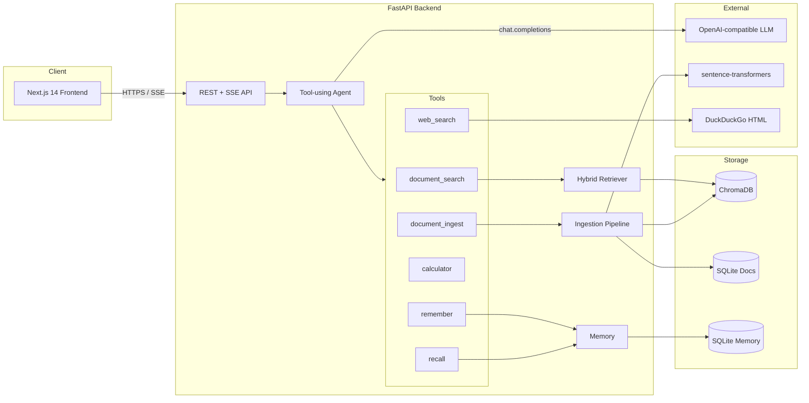

# IR-Agent — Information Retrieval AI Agent

A production-quality tool-using AI agent built around modern Information
Retrieval. IR-Agent answers questions by searching a private document corpus
(hybrid BM25 + dense + cross-encoder reranking), falling back to web search,
remembering facts across sessions, and executing deterministic skills such as
arithmetic and document ingestion — all driven by an OpenAI-compatible
function-calling LLM.

[](https://github.com/your-org/ir-agent/actions/workflows/ci.yml)


---

## University Assignment Mapping

| Requirement                                            | Implementation                                                                    |
| ------------------------------------------------------ | --------------------------------------------------------------------------------- |
| Build your own AI agent                                | `app/services/agent.py` — full OpenAI-format function-calling loop                |
| Improve context through IR methods                     | `HybridRetriever` (BM25 + dense + RRF + cross-encoder rerank)                     |
| Working memory system                                  | `WorkingMemory` (per-session rolling buffer) + `MemoryService` (persistent K/V)   |
| Skills / tools (agent actions)                         | `document_search`, `document_ingest`, `web_search`, `calculator`, `remember`, `recall` |
| Web search                                             | `WebSearchTool` using DuckDuckGo HTML (no API key)                                |
| Document search and update                             | `DocumentSearchTool`, `DocumentIngestTool` + REST endpoints                       |
| OpenAI-format API key                                  | `openai.AsyncOpenAI` — supports OpenAI, Azure OpenAI, Ollama, any compatible API  |
| Runnable on GitHub                                     | `docker compose up` — single command, no model downloads in mock mode             |
| Future extension                                       | Tools, embedders, vector stores, rerankers are all swappable behind protocols     |

A short walk-through video can be recorded by running the seed corpus
ingestion, asking the questions in [docs/screenshots/README.md](docs/screenshots/README.md),
and capturing the chat UI plus the Swagger `/docs` page.

## Table of Contents

1. [Highlights](#highlights)
2. [Architecture](#architecture)
3. [Project Structure](#project-structure)
4. [Quick Start](#quick-start)
5. [Configuration](#configuration)
6. [API Documentation](#api-documentation)
7. [Agent Tools](#agent-tools)
8. [Development](#development)
9. [Testing](#testing)
10. [Deployment](#deployment)
11. [Screenshots](#screenshots)
12. [License](#license)

## Highlights

- **Tool-using agent** — OpenAI function-calling loop with six built-in skills,
  parallel tool dispatch, and a max-iteration safety cap.
- **Hybrid retrieval** — Reciprocal Rank Fusion of BM25 and dense embeddings
  plus optional cross-encoder reranking.
- **Working + long-term memory** — bounded per-session buffer plus a
  SQLite-backed key/value store exposed through `remember` / `recall` tools.
- **Multi-format ingestion** — PDF, DOCX, TXT, MD, HTML; sentence-aware
  sliding-window chunker.
- **Streaming UX** — Server-Sent Events stream of tool traces, citations, and
  tokens to the Next.js frontend.
- **OpenAI-format key** — works with OpenAI, Azure, Ollama, vLLM, llama.cpp.
  Set `OPENAI_BASE_URL` to retarget.
- **Offline mock mode** — `MOCK_LLM=true` runs the whole stack without any
  network access. CI uses it; you can use it for assignment grading.
- **Production-ready** — Docker, docker-compose, GitHub Actions CI, structured
  JSON logging, request IDs, rate limiting, optional API-key auth.
- **High test coverage** — pytest unit + integration suites for chunker,
  retriever, tools, memory, agent, and API.

## Architecture



Full system design: [docs/architecture.md](docs/architecture.md).

## Project Structure

```
ai-agent/
├── backend/
│   ├── app/
│   │   ├── api/                  # FastAPI routes, deps, middleware
│   │   │   ├── routes/           # health, documents, search, chat, tools
│   │   │   ├── deps.py
│   │   │   └── middleware.py
│   │   ├── core/                 # config-independent infrastructure
│   │   │   ├── exceptions.py
│   │   │   ├── logging.py
│   │   │   └── security.py
│   │   ├── models/               # Pydantic schemas + domain entities
│   │   │   ├── domain.py
│   │   │   └── schemas.py
│   │   ├── repositories/         # ChromaDB + SQLite adapters
│   │   │   ├── vector_store.py
│   │   │   └── document_store.py
│   │   ├── services/             # business logic
│   │   │   ├── tools/            # document_search, web_search, calculator, …
│   │   │   ├── agent.py          # tool-using function-calling loop
│   │   │   ├── retriever.py      # BM25 + dense + RRF
│   │   │   ├── reranker.py       # cross-encoder reranker
│   │   │   ├── embedder.py
│   │   │   ├── ingestion.py
│   │   │   ├── parsers.py        # PDF, DOCX, HTML, MD, TXT
│   │   │   ├── memory.py
│   │   │   ├── llm.py            # direct OpenAI / Anthropic clients
│   │   │   └── openai_client.py
│   │   ├── utils/                # text + chunker
│   │   ├── config.py
│   │   └── main.py
│   ├── data/seed/                # seed corpus (5 IR essays)
│   ├── tests/                    # pytest suite
│   ├── Dockerfile
│   ├── pyproject.toml
│   ├── requirements.txt
│   └── requirements-dev.txt
├── frontend/
│   ├── src/
│   │   ├── app/                  # Next.js App Router
│   │   ├── components/           # ChatInterface, Sidebar, SourceCard, …
│   │   ├── hooks/                # useChat, useDocuments
│   │   └── lib/                  # api client + shared types
│   ├── Dockerfile
│   ├── next.config.js
│   ├── package.json
│   ├── tailwind.config.ts
│   └── tsconfig.json
├── docs/
│   ├── architecture.md
│   ├── api.md
│   └── screenshots/
├── .github/workflows/ci.yml
├── docker-compose.yml
├── .env.example
├── .gitignore
├── LICENSE
└── README.md
```

## Quick Start

### Option 1 — Docker Compose (recommended)

```bash
git clone https://github.com/your-org/ir-agent.git
cd ir-agent
cp .env.example .env             # add OPENAI_API_KEY, or leave MOCK_LLM=true
docker compose up --build
```

- Frontend: <http://localhost:3000>
- Backend: <http://localhost:8000>
- Swagger UI: <http://localhost:8000/docs>

### Option 2 — Local dev

```bash
# --- Backend -------------------------------------------------------------
cd backend
python -m venv .venv && source .venv/bin/activate
pip install -r requirements.txt
cp ../.env.example ../.env
uvicorn app.main:app --reload --port 8000

# --- Frontend ------------------------------------------------------------
cd ../frontend
npm install
npm run dev
```

### Seed the corpus

The bundled `backend/data/seed/` contains five Information Retrieval essays.
Load them with one click in the sidebar, or:

```bash
curl -X POST http://localhost:8000/api/v1/documents/ingest-seed
```

### Ask a question (no UI needed)

```bash
curl -X POST http://localhost:8000/api/v1/chat \
     -H "Content-Type: application/json" \
     -H "X-Session-ID: $(uuidgen)" \
     -d '{"query":"What is reciprocal rank fusion?"}'
```

## Configuration

Configuration is loaded from environment variables (or a project-root `.env`).
See [`.env.example`](.env.example) for the complete list.

| Variable             | Default                                  | Description                                    |
| -------------------- | ---------------------------------------- | ---------------------------------------------- |
| `APP_ENV`            | `development`                            | `development` / `test` / `production`          |
| `OPENAI_API_KEY`     | _empty_                                  | Required unless `MOCK_LLM=true`                |
| `OPENAI_BASE_URL`    | _empty_                                  | Set for Azure / Ollama / any compatible API    |
| `LLM_MODEL`          | `gpt-4o-mini`                            | Any model name your provider exposes           |
| `MOCK_LLM`           | `false`                                  | Run fully offline with a deterministic mock    |
| `EMBEDDING_MODEL`    | `all-MiniLM-L6-v2`                       | sentence-transformers model                    |
| `RERANKER_MODEL`     | `cross-encoder/ms-marco-MiniLM-L-6-v2`   | Cross-encoder reranker                         |
| `VECTOR_STORE_PATH`  | `./data/chroma`                          | ChromaDB persistence directory                 |
| `CHUNK_SIZE`         | `512`                                    | Tokens per chunk                               |
| `CHUNK_OVERLAP`      | `64`                                     | Token overlap between chunks                   |
| `TOP_K_RETRIEVAL`    | `20`                                     | Candidates retrieved per branch                |
| `TOP_K_RERANK`       | `5`                                      | Documents kept after reranking                 |
| `API_KEY`            | _empty_                                  | If set, all endpoints require `X-API-Key`      |

## API Documentation

Interactive Swagger UI at <http://localhost:8000/docs>. Full reference in
[docs/api.md](docs/api.md).

| Method | Path                              | Description                              |
| ------ | --------------------------------- | ---------------------------------------- |
| GET    | `/api/v1/health`                  | Liveness probe + corpus stats            |
| GET    | `/api/v1/tools`                   | List available agent tools               |
| GET    | `/api/v1/documents`               | List indexed documents                   |
| POST   | `/api/v1/documents/upload`        | Upload & ingest a file                   |
| POST   | `/api/v1/documents/ingest-seed`   | Ingest bundled seed corpus               |
| DELETE | `/api/v1/documents/{id}`          | Remove a document                        |
| POST   | `/api/v1/search`                  | Direct hybrid search                     |
| POST   | `/api/v1/chat`                    | Agentic Q&A (non-streaming)              |
| POST   | `/api/v1/chat/stream`             | Agentic Q&A (SSE stream)                 |

## Agent Tools

| Tool              | When it fires                                                 |
| ----------------- | ------------------------------------------------------------- |
| `document_search` | Default first action — search the indexed corpus              |
| `document_ingest` | Save new information ("remember this document for me")        |
| `web_search`      | Fallback when corpus has no relevant passages                 |
| `calculator`      | Deterministic arithmetic and unit-style math                  |
| `remember`        | Persist a stable user fact / preference                       |
| `recall`          | Look up a previously remembered fact                          |

Add a new tool by subclassing `Tool` and registering it in
`AppContainer._build_tools` — the agent automatically advertises it to the
LLM through OpenAI function calling.

## Development

```bash
# Dev dependencies
pip install -r backend/requirements-dev.txt

# Lint + type check
ruff check backend/app backend/tests
mypy backend/app

# Format
ruff format backend/app

# Frontend
cd frontend && npm run lint && npm run type-check && npm run build
```

## Testing

```bash
cd backend
pytest -v                          # uses mock LLM + in-memory vector store
pytest --cov=app --cov-report=html
open htmlcov/index.html
```

CI runs the suite on Python 3.11 and 3.12 plus a full Docker build of both
images (see `.github/workflows/ci.yml`).

## Deployment

```bash
docker compose up -d --build
```

Production checklist:

- Set `APP_ENV=production` and a strong `API_KEY`.
- Persist `./data/` via a named volume (already configured in
  `docker-compose.yml`).
- Front the API with HTTPS (nginx / Caddy / cloud LB).
- Keep `RATE_LIMIT_PER_MINUTE` aligned with your traffic.
- Ship the structured JSON logs to your aggregator.

## Screenshots

Placeholders live in [docs/screenshots/](docs/screenshots/) with capture
instructions in [docs/screenshots/README.md](docs/screenshots/README.md):

- `01-chat.png` — chat answering a corpus question with expanded citations
- `02-tools.png` — tool-call badges (document_search, calculator, remember)
- `03-upload.png` — drag-and-drop document upload + corpus list
- `04-search.png` — direct `/search` Swagger try-it-out
- `05-api-docs.png` — full Swagger UI overview

## License

MIT — see [LICENSE](LICENSE).

---

_Built as a university Information Retrieval coursework deliverable. Pull requests welcome._
