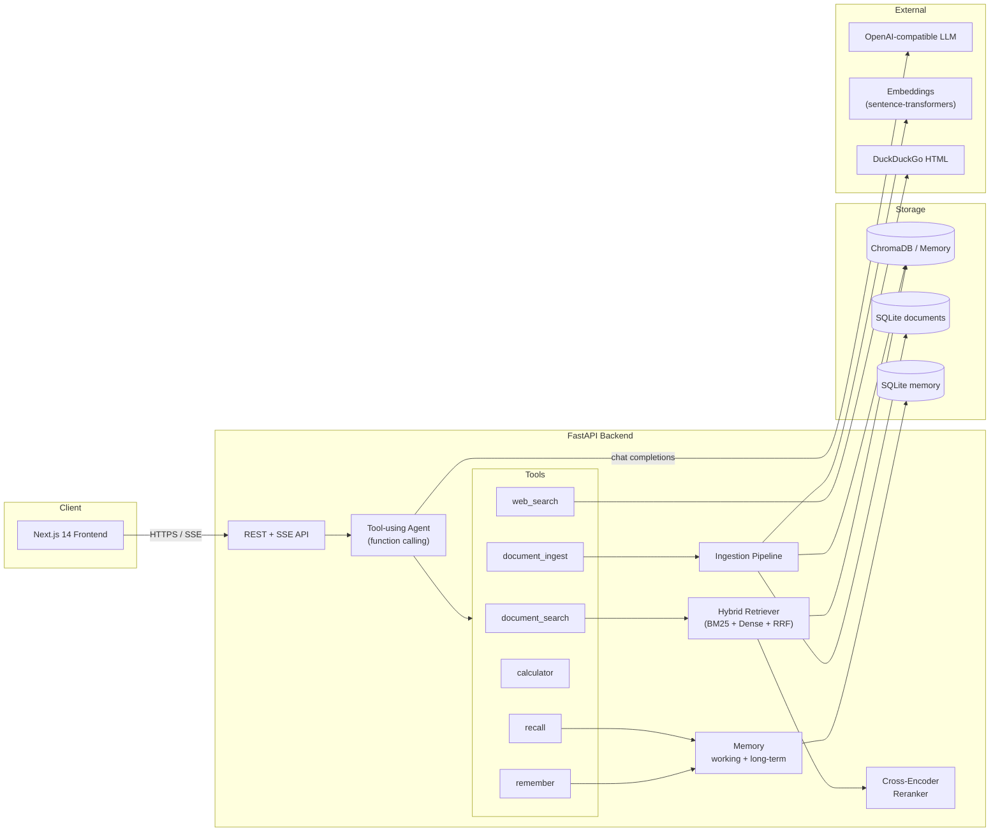
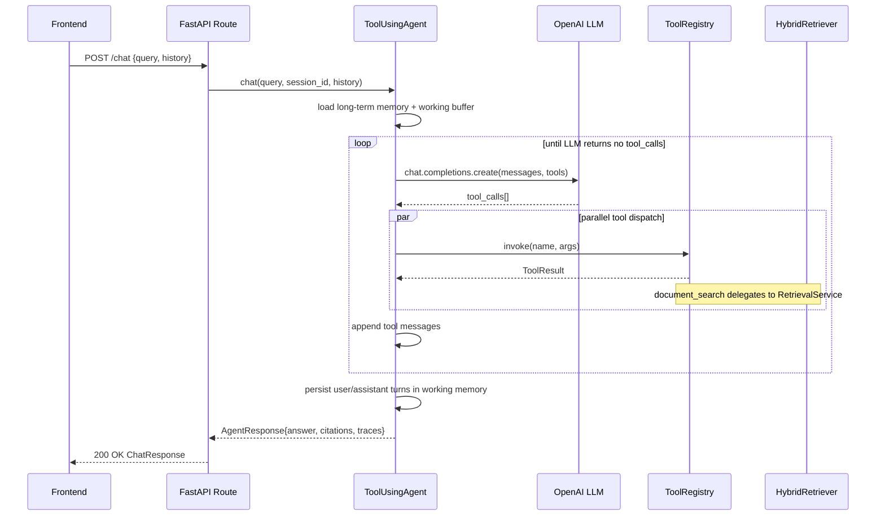

# IR-Agent — Architecture

This document describes the technical design of IR-Agent. It is the deliverable
counterpart to the source code: each module's role, the responsibilities it
owns, and the boundaries it respects.

## 1. Goals

The university-assignment brief calls for:

> An AI agent that reliably finds context to answer questions and perform
> tasks, extended with Information Retrieval methods such as a working memory
> system, skills, web search, and document search/update.

IR-Agent satisfies these by combining three orthogonal capabilities:

1. **Hybrid Retrieval** — lexical + dense + cross-encoder reranking over an
   ingested document corpus.
2. **Tool use** — an OpenAI-format function-calling loop that lets the LLM
   invoke search, web search, calculator, document ingestion, and memory
   tools.
3. **Memory** — bounded per-session working memory plus durable long-term
   key/value memory exposed through `remember` / `recall` tools.

## 2. High-Level Diagram



## 3. Layering

The backend follows a strict layered architecture; dependencies only flow
downward.

| Layer | Modules | Responsibility |
|-------|---------|----------------|
| **API** | `app/api/routes/*`, `app/api/deps.py`, `app/main.py` | HTTP & SSE adapters, dependency injection, exception → response mapping |
| **Services** | `app/services/*` | Business logic: retrieval, agent loop, ingestion, embeddings, tools |
| **Repositories** | `app/repositories/*` | Persistence adapters (ChromaDB, SQLite) — no business rules |
| **Domain / Models** | `app/models/*` | Pydantic schemas (API contracts) and dataclasses (domain entities) |
| **Core / Utils** | `app/core/*`, `app/utils/*` | Cross-cutting concerns: config, logging, text utilities |

### SOLID compliance

- **S**ingle responsibility — every module has one reason to change.
- **O**pen / closed — `ToolRegistry` accepts new tools without modification;
  `VectorStore`, `Embedder`, `Reranker`, and `LLMService` are protocols so new
  providers can drop in.
- **L**iskov — protocol implementations are mutually substitutable (e.g.
  `InMemoryVectorStore` ↔ `ChromaVectorStore`).
- **I**nterface segregation — protocols expose only the methods callers need.
- **D**ependency inversion — `AppContainer` injects abstractions, never
  concrete implementations, into the agent and services.

## 4. Request Lifecycle — `POST /api/v1/chat`



## 5. Hybrid Retrieval

Hybrid retrieval blends two complementary recall signals:

1. **Dense** — query embedded with `sentence-transformers`, top-K nearest
   neighbours fetched from ChromaDB (cosine).
2. **Sparse** — BM25-Okapi over a lazily-built in-memory index of every chunk
   text. The index is invalidated whenever ingestion or deletion changes the
   corpus.

The two ranked lists are merged with **Reciprocal Rank Fusion** (Cormack et al.,
SIGIR 2009):

```
score(d) = Σ_branch  1 / (k + rank_branch(d))
```

with `k=60` (the canonical default). The fused top-N is then optionally
re-ranked by a cross-encoder (`ms-marco-MiniLM-L-6-v2` by default) for the
final list returned to the agent.

## 6. Agent Loop

The agent is a single-actor OpenAI-style function-calling loop:

```python
for _ in range(max_iterations):
    completion = await llm.chat.completions.create(messages, tools=tool_schemas)
    if not completion.tool_calls:
        return completion.content
    parallel_dispatch(completion.tool_calls)
    append_tool_messages(messages)
```

Why function-calling rather than free-form ReAct?

- Models produce typed JSON arguments, eliminating output-parsing brittleness.
- Multiple tool calls can be dispatched in parallel within one iteration.
- The same prompt works across providers that implement the OpenAI tool
  schema (OpenAI, Azure OpenAI, Ollama, vLLM, llama-cpp-python, etc.).

A `max_iterations` safety cap (default 6) prevents runaway loops.

## 7. Memory Model

- **Working memory** (`WorkingMemory`) is a bounded `deque` per session id,
  capped at 20 turns. It is rehydrated into every agent prompt.
- **Long-term memory** (`MemoryService`) is a SQLite key/value table. The
  agent writes to it through the `remember` tool and reads it both through
  `recall` and automatically at the top of each turn (the system prompt
  includes the current key/value snapshot).

This separation matches the assignment's requirement for a working-memory
system while keeping persistent facts auditable and easy to delete.

## 8. Persistence

| Store | Backend | Path |
|-------|---------|------|
| Vector store | ChromaDB persistent client (cosine) | `./data/chroma` |
| Document metadata | SQLite | `./data/documents.db` |
| Long-term memory | SQLite | `./data/documents_memory.db` |

In test mode (`VECTOR_STORE_PROVIDER=memory`) the vector store is replaced by
`InMemoryVectorStore` so the suite needs no IO or model weights.

## 9. Observability

- **structlog** emits JSON in production, colour-rendered output in dev.
- Every request gets a `request_id` propagated via context-vars and echoed on
  the `X-Request-ID` response header.
- Latency, retrieval hit counts, tool invocations, and iteration counts are
  logged at INFO level.

## 10. Security

- Optional `X-API-Key` auth — when `API_KEY` is set, every `/api/v1/*` route
  requires the header.
- Rate limiting via `slowapi`, default 60/minute per IP.
- Calculator tool restricts evaluation to a whitelisted AST subset.
- Document uploads are size-capped (`MAX_UPLOAD_SIZE_MB`, default 25 MB).

## 11. Extension Points

| Want to… | Where |
|----------|-------|
| Add a new agent tool | Subclass `Tool` and register in `AppContainer._build_tools` |
| Swap embedding model | Set `EMBEDDING_MODEL` in `.env` |
| Use Azure OpenAI / Ollama | Set `OPENAI_BASE_URL` and `OPENAI_API_KEY` |
| Use a different vector DB | Implement `VectorStore` and update `_build_vector_store` |
| Replace the reranker | Implement `Reranker` and update `_build_reranker` |
| Change the chunking strategy | Replace `TextChunker` in `AppContainer.__init__` |

## 12. Trade-offs and Future Work

- **Single-actor agent** — adequate for retrieval-heavy tasks. For long-horizon
  planning, a planner/executor split (LangGraph-style) would help.
- **In-memory BM25** — rebuilt on demand; fine up to a few hundred thousand
  chunks. Beyond that, swap to Tantivy or Elasticsearch.
- **No streaming tool execution** — currently the SSE endpoint runs the whole
  agent loop and then streams the assembled answer. A token-by-token version
  would require provider-specific delta handling.
